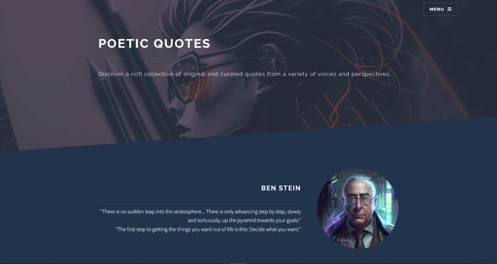

This project is about:
## POETIC INSPIRATION WEBSITE
This website is a collection of poetry resources designed to inspire and engage readers.
The website features four pages:

## 1. Landing page:
- This page provides an introduction to the website and the content that can be found on the other pages.

## 2. Inspirations page: 
This page features audio files, videos, and written works that are designed to inspire and motivate readers. From talks by well-known motivational speakers to readings from famous poets, this page provides a wide range of content to help readers find inspiration and meaning.

## 3. Book review page:
This page features reviews of poetry books and collections, written by our team of poetry experts. These reviews are designed to help readers discover new works and deepen their understanding of poetry.

## 4. Quotes page: 
This page features a curated selection of famous quotes and passages from some of the most well-known poets and writers of all time. These quotes are intended to inspire and encourage readers, providing a source of motivation and insight.

- Overall, our goal is to create a space where readers can explore the beauty and power of poetry. Whether you are an avid poetry reader or just beginning to explore this genre, we hope that our website provides something of value for you.

## Website Link
- https://poetic-inspirations.netlify.app/